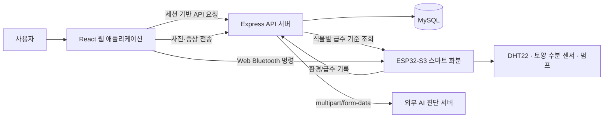

# Refresh

> 센서 데이터와 자동 급수를 이용해 초보자도 식물 상태를 확인하고 관리할 수 있도록 만든 IoT 스마트 화분 서비스

Refresh는 식물 관리 과정에서 생기는 “언제 물을 줘야 하는가”, “잎 상태가 왜 달라졌는가” 같은 문제를 센서 데이터, 관리 기록, AI 진단, 자동 급수로 연결한 졸업작품입니다. 웹 대시보드에서 식물별 상태를 확인하고, ESP32 기반 기기가 측정과 급수를 수행합니다.

## 프로젝트 목표

- 감에 의존하던 식물 관리를 토양 수분과 환경 데이터 중심의 관리 흐름으로 전환
- 식물 사진과 증상 입력을 바탕으로 관리 방향을 제안하는 AI 진단 제공
- 토양 수분 기준에 따라 자동 급수하거나 웹에서 직접 급수 명령 전송
- 식물, 환경 기록, 급수 기록, 진단 기록을 식물별로 관리
- 식물 관리 경험을 공유할 수 있는 커뮤니티 제공

## 핵심 기능

| 구분 | 기능 |
| --- | --- |
| 회원 | 회원가입, 로그인/로그아웃, 이메일 인증, 소셜 로그인 연동, 프로필과 알림 설정 |
| 식물 관리 | 식물 등록·보관·삭제, 사진 등록, 식물별 관리 화면, 선택 식물 복원 |
| 환경 모니터링 | 온도, 습도, 토양 수분, 조도 데이터 확인, 최근 수신 시각, 주간 차트와 임계값 표시 |
| 급수 | 수동 급수, 자동/수동 모드 전환, 급수 기록 조회, 식물별 최소 수분·펌프 작동 시간 설정 |
| AI 진단 | 식물 사진과 증상 입력, 진단 세션 저장, 관리 방법과 급수 기준 안내, AI 장애 시 센서 기반 안내 |
| 기기 연동 | Web Bluetooth 연결, ESP32 명령 전송, Wi-Fi 환경 데이터 전송, 서버 급수 설정 주기 동기화 |
| 커뮤니티 | 게시글·이미지 작성, 댓글, 좋아요, 카테고리별 조회 |

## 서비스 흐름



## 사용자 시나리오

1. 사용자가 회원가입 후 식물의 이름, 종류, 사진, 등록일을 입력한다.
2. ESP32 기기를 식물 ID와 연결하고 Wi-Fi를 설정한다.
3. 기기는 토양 수분·온도·습도 데이터를 서버에 주기적으로 전송한다.
4. 웹 대시보드는 최신 환경 데이터, 주간 변화, 급수 이력, 알림을 보여 준다.
5. 사용자는 Web Bluetooth로 급수·자동 모드·Wi-Fi 설정 등의 명령을 기기에 전송할 수 있다.
6. 토양 수분이 기준보다 낮으면 자동 급수가 실행되고, 결과는 급수 기록으로 저장된다.
7. 잎 상태가 좋지 않으면 사진과 증상을 입력해 AI 진단을 요청한다.
8. AI 결과, 센서 데이터, 이전 기록을 참고해 식물별 급수 기준을 조정한다.

## 기술 스택

### Frontend

| 분류 | 기술 |
| --- | --- |
| Framework | React 19, Vite 7 |
| Routing | React Router DOM 7 |
| HTTP | Axios, Fetch API |
| 상태 관리 | React Context API, Hooks |
| 차트 | Chart.js, react-chartjs-2, Recharts |
| UI | CSS, React Icons, SweetAlert2 |
| 기기 통신 | Web Bluetooth API |
| 모바일 확장 | Capacitor Android 설정 |

### Backend

| 분류 | 기술 |
| --- | --- |
| Runtime / Framework | Node.js, Express 5 |
| ORM | Sequelize 6 |
| Database | MySQL / mysql2 |
| 인증 | express-session, cookie-parser, bcrypt |
| 입력 검증 | Joi |
| 파일 업로드 | Multer |
| 외부 통신 | Axios, FormData |
| 이메일 | Nodemailer |
| AI 연동 | 외부 식물 진단 API, Google Generative AI SDK |
| 운영 보조 | dotenv, cors, morgan, connect-flash |

### IoT Hardware

| 분류 | 기술 |
| --- | --- |
| Board | ESP32-S3 DevKitC-1 |
| Framework | Arduino, PlatformIO |
| Sensor | DHT22 온습도 센서, 토양 수분 센서 |
| Actuator | DC 펌프, PWM 기반 펌프 제어 |
| Communication | Wi-Fi, HTTPClient, BLE, Preferences |
| Data format | ArduinoJson |

## 아키텍처와 설계

### Frontend 구조

```text
frontend/src
├─ api/             # Axios 인스턴스와 인증 API
├─ app/             # 공통 상수와 알림 설정
├─ components/      # Header, Bottom, Bluetooth, Skeleton, ErrorBoundary
├─ context/         # 로그인 세션, Bluetooth 상태
├─ hooks/           # 센서 데이터 조회, Bluetooth 접근
├─ layout/          # 공통 레이아웃
├─ pages/           # Login, Profile, Menu, Chat, Community, Setting
└─ styles/          # 전역 디자인 토큰과 공통 컴포넌트 스타일
```

- React `lazy`와 `Suspense`로 페이지 단위 코드를 분리합니다.
- `ErrorBoundary`와 Skeleton UI로 요청 지연·렌더링 오류 상황에서 빈 화면을 막습니다.
- `VITE_API_BASE_URL`이 비어 있으면 상대 경로 `/api`를 사용하고, 개발 중에는 Vite proxy가 backend로 요청을 전달합니다.
- Bluetooth 상태와 기기 명령은 `BluetoothContext`에서 관리하여 메뉴·설정·식물 등록 화면이 같은 연결 상태를 공유합니다.

### Backend 구조

```text
backend
├─ app.js                   # Express 미들웨어, CORS, 세션, 라우터 등록
├─ bin/www                  # dotenv 로드와 HTTP 서버 실행
├─ domain/
│  ├─ user/                 # 회원, 인증, 프로필
│  ├─ plant/                # 식물과 급수 기준
│  ├─ EnvironmentLog/       # 센서 환경 기록과 주간 통계
│  ├─ wateringLog/          # 급수 기록
│  ├─ diagnosisLog/         # AI 진단과 세션 기록
│  ├─ notification/         # 상태 알림
│  └─ community/            # 게시글, 댓글, 좋아요
├─ middleware/              # 입력 검증과 식물 소유자 권한 검증
├─ utils/                   # Multer 설정
└─ global/                  # DB 환경 설정
```

- `Controller → Service → Repository → Model` 책임을 분리했습니다.
- 식물 ID가 포함된 사용자 API는 세션 사용자와 식물 소유자를 비교해 `401`, `403`, `404`를 구분합니다.
- 센서와 급수 기록은 식물 ID 기준으로 저장하고, 대시보드에서는 최신 값과 기간별 통계를 분리해 사용합니다.
- AI 서버가 응답하지 않으면 화면을 실패 상태로 두지 않고, 현재 센서값을 이용한 관리 안내를 반환합니다. 이 안내는 사진 기반 AI 진단과 구분해 표시합니다.

## 주요 API

| 기능 | Method | Endpoint |
| --- | --- | --- |
| 로그인 | `POST` | `/api/user/login` |
| 현재 세션 확인 | `GET` | `/api/user/check` |
| 프로필 조회·수정 | `GET`, `PUT` | `/api/user/profile` |
| 식물 목록·등록 | `GET`, `POST` | `/api/plants` |
| 식물 보관·삭제 | `PATCH`, `DELETE` | `/api/plants/:id/archive`, `/api/plants/:id` |
| 급수 기준 조회·수정 | `GET`, `PATCH` | `/api/plants/:id/hardware` |
| 환경 기록 수신 | `POST` | `/api/environment-log` |
| 환경 이력·주간 통계 | `GET` | `/api/environment-log/:plantId`, `/api/environment-log/stats/:plantId` |
| 급수 기록 수신·조회 | `POST`, `GET` | `/api/watering-log`, `/api/watering-log/:plantId` |
| AI 진단 생성·조회 | `POST`, `GET` | `/api/diagnosis-logs/:plantId` |
| 진단 세션 관리 | `PUT`, `DELETE` | `/api/diagnosis-logs/session/:sessionId` |
| 알림 조회·읽음 | `GET`, `PATCH` | `/api/notifications/:plantId`, `/api/notifications/read/:id` |
| 커뮤니티 | `GET`, `POST` | `/api/community` |

## AI 진단과 자동 급수

### AI 진단

1. 사용자가 식물 사진과 증상을 `multipart/form-data`로 전송합니다.
2. backend는 식물 종류와 사용 가능한 센서 데이터를 함께 외부 AI 서버에 전달합니다.
3. 결과의 상태, 권장 조치, 신뢰도를 진단 기록으로 저장합니다.
4. AI 서버 장애 시에는 토양 수분·온도 기반의 관리 안내를 반환하고, UI에 센서 기반 안내임을 명시합니다.

### 자동 급수

1. 사용자는 식물별 최소 토양 수분과 펌프 작동 시간을 설정합니다.
2. ESP32는 서버에서 해당 기준을 주기적으로 조회합니다.
3. 토양 수분이 기준보다 낮으면 펌프를 구동하고 급수 기록을 서버로 전송합니다.
4. 웹에서는 자동/수동 모드, 급수 이력, 최근 환경 데이터를 확인합니다.

## 로컬 실행

### 요구 사항

- Node.js 20 이상 권장
- MySQL 8 이상
- PlatformIO와 ESP32-S3 보드 환경
- Web Bluetooth를 지원하는 Chromium 계열 브라우저

### 1. Backend

```bash
cd backend
copy .env.example .env
npm install
npm start
```

`backend/.env`에서 DB, 세션, 이메일, AI 서버 값을 설정합니다.

```env
PORT=8080
COOKIE_SECRET=replace-with-a-long-random-secret
AI_SERVER_URL=https://your-ai-server.example.com/predict
CORS_ORIGINS=http://localhost:5173
DB_HOST=localhost
DB_PORT=3306
DB_NAME=smartplant
DB_USER=your-db-user
DB_PASSWORD=your-db-password
```

### 2. Frontend

```bash
cd frontend
copy .env.example .env.local
npm install
npm run dev
```

개발 환경에서는 `frontend/.env.local`에 backend 주소를 지정합니다.

```env
VITE_API_BASE_URL=
VITE_API_PROXY_TARGET=http://localhost:8080
```

### 3. ESP32 Firmware

1. `PlatformIO/Projects/esp32_test`를 PlatformIO로 엽니다.
2. 보드 환경을 `esp32-s3-devkitc-1`로 선택합니다.
3. 센서·펌프 배선과 Wi-Fi 설정을 확인합니다.
4. 펌웨어를 업로드하고 시리얼 모니터를 `115200`으로 엽니다.
5. 웹에서 Bluetooth 연결 후 식물 ID를 전송합니다.

## 검증

```bash
cd frontend
npm run lint

cd ../backend
node --check app.js
node --check domain/plant/router.js
node --check domain/diagnosisLog/service.js
```

## 강조할 점

- 웹 서비스와 ESP32 펌웨어를 연결해 센서 수집부터 급수 실행, 기록 조회까지 하나의 흐름으로 구현
- React Context와 Web Bluetooth API를 이용해 브라우저와 기기 사이의 실시간 명령 전달 구현
- Express·Sequelize 기반의 도메인 분리와 세션 기반 식물 소유자 권한 검증 적용
- AI 분석 서버 장애 시 센서 기반 안내로 전환하는 fallback을 구현해 빈 화면과 요청 실패 경험을 줄임
- 환경·급수·진단 데이터를 식물 단위로 축적하고, 차트와 관리 화면에서 사용자 판단을 지원

## Repository

- GitHub: https://github.com/refresh-groot/refresh

